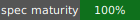

[](https://pypi.org/project/holonic/)


A lightweight Python client for building holonic knowledge graphs (based on Cagel's four-graph holonic RDF model) backed by rdflib, Apache Jena Fuseki, or any SPARQL-compliant quad store.

## The Four-Graph Model

Every `Holon` has four (or more!) named graphs, each answering a distinct question:

| Layer          | Question                | RDF Mechanism                       |
| -------------- | ----------------------- | ----------------------------------- |
| **Interior**   | What is true inside?    | Named graph, A-Box triples          |
| **Boundary**   | What is allowed?        | SHACL shapes, portal definitions    |
| **Projection** | What do outsiders see?  | External bindings, translated vocab |
| **Context**    | Where does this belong? | Membership, temporal annotations    |

The holon's IRI threads through all four layers as both the identity anchor and a subject in cross-layer triples.

## Design Principle

> The dataset IS the holarchy. Python methods are convenience, not architecture.

A holon is not a Python object containing four `rdflib.Graph` attributes. A holon is an **IRI** whose associated named graphs exist in an RDF dataset. Portals are RDF triples in boundary graphs, discoverable via SPARQL. Traversal runs CONSTRUCT queries against the dataset with `GRAPH` scoping. All state lives in the quad store.

## Install

```bash
pip install holonic
```

Optional extras: `holonic[dev]`, `holonic[docs]`, `holonic[fuseki]`, `holonic[notebooks]`, `holonic[viz]`.

> `conda-forge` support is in progress. Until the feedstock lands, install via `pip` inside a conda or mamba environment.

## Dev Install

Requires [`pixi`](https://pixi.sh).

```bash
pixi run -e dev first    # editable install + lint + tests + docs
pixi run -e dev test     # tests only
pixi run serve           # jupyterlab with the example notebooks
```

See [`CONTRIBUTING.md`](./CONTRIBUTING.md) for the full development setup, including the separate `spec` pixi environment used by the SPEC validation pipeline.

## Quick Start

```python
from holonic import HolonicDataset

ds = HolonicDataset()  # rdflib in-memory backend

# Create a holon with multiple interior graphs
ds.add_holon("urn:holon:sensor-a", "Sensor A")
ds.add_interior("urn:holon:sensor-a", '''
    <urn:track:001> a <urn:type:Track> ;
        <urn:prop:lat> 34.05 ;
        <urn:prop:lon> -118.25 .
''', graph_iri="urn:holon:sensor-a/interior/radar")

ds.add_interior("urn:holon:sensor-a", '''
    <urn:track:001> <urn:prop:confidence> 0.92 .
''', graph_iri="urn:holon:sensor-a/interior/fusion")

# Query across all interiors
rows = ds.query('''
    SELECT ?track ?lat ?conf WHERE {
        GRAPH ?g1 { ?track <urn:prop:lat> ?lat }
        GRAPH ?g2 { ?track <urn:prop:confidence> ?conf }
    }
''')
```

## Backends

| Backend         | Import                                                      | Infrastructure   |
| --------------- | ----------------------------------------------------------- | ---------------- |
| `RdflibBackend` | `from holonic import RdflibBackend`                         | None (in-memory) |
| `FusekiBackend` | `from holonic.backends.fuseki_backend import FusekiBackend` | Fuseki server    |
| Custom          | Implement `HolonicStore` protocol                           | Any quad store   |

```python
# Fuseki backend
from holonic.backends.fuseki_backend import FusekiBackend

ds = HolonicDataset(
    backend=FusekiBackend("http://localhost:3030", dataset="holarchy")
)
```

> Migrating from 0.3.x? `GraphBackend` is now `HolonicStore` (old
> name kept as a deprecated alias through 0.4.x) and `FusekiBackend`
> requires `dataset` as a keyword argument. See
> [`docs/MIGRATION.md`](./docs/MIGRATION.md) for the full checklist.

## Key Concepts

### Holons Have Multiple Interior Graphs

A holon's interior is a *set* of named graphs, not a single graph:

```python
ds.add_interior(holon, ttl_a, graph_iri="urn:holon:x/interior/radar")
ds.add_interior(holon, ttl_b, graph_iri="urn:holon:x/interior/eo-ir")
```

### Portals Are RDF, Discovered via SPARQL

```python
# Register (writes triples into boundary graph)
ds.add_portal("urn:portal:a-to-b", source, target, construct_query)

# Discover (SPARQL query, not Python iteration)
portals = ds.find_portals_from("urn:holon:source")
path = ds.find_path("urn:holon:a", "urn:holon:c")  # multi-hop BFS
```

### Traversal Runs CONSTRUCT Against the Dataset

```python
# Low-level: execute a portal's CONSTRUCT
projected = ds.traverse_portal("urn:portal:a-to-b",
                                inject_into="urn:holon:b/interior")

# High-level: find portal → traverse → validate → record provenance
projected, membrane = ds.traverse(
    "urn:holon:source", "urn:holon:target",
    validate=True,
    agent_iri="urn:agent:pipeline",
)
```

### Membrane Validation Operates on Graph Unions

```python
result = ds.validate_membrane("urn:holon:target")
# Validates union of all cga:hasInterior graphs
# against union of all cga:hasBoundary graphs
```

### Projections: RDF → Visualization

Two modes: **CONSTRUCT** (stays in RDF, storable in the holarchy) and **Pythonic** (exits RDF into dicts/LPG for visualization).

```python
from holonic import project_to_lpg, ProjectionPipeline, CONSTRUCT_STRIP_TYPES

# Full LPG projection — types, literals, blank nodes, lists all collapsed
lpg = project_to_lpg(graph,
    collapse_types=True,       # rdf:type → node.types list
    collapse_literals=True,    # literals → node.attributes dict
    resolve_blanks=True,       # blank nodes → nested dicts
    resolve_lists=True,        # rdf:first/rest → Python lists
)
lpg.to_dict()  # JSON-serializable

# Composable pipeline (CONSTRUCT + Python transforms)
lpg = (
    ProjectionPipeline("viz-prep")
    .add_construct("strip_types", CONSTRUCT_STRIP_TYPES)
    .add_transform("localize", localize_predicates)
    .apply_to_lpg(source_graph)
)

# Project a holon (merge interiors → LPG, store result)
lpg = ds.project_holon("urn:holon:air", store_as="urn:holon:air/projection/viz")

# Project the holarchy topology (holons as nodes, portals as edges)
topo = ds.project_holarchy()
```

## CGA Ontology

The package includes a lightweight OWL 2 RL vocabulary (`holonic/ontology/cga.ttl`) and SHACL shapes (`cga-shapes.ttl`) defining the structural concepts: `cga:Holon`, `cga:Portal` with subclasses `cga:TransformPortal` / `cga:IconPortal` / `cga:SealedPortal`, `cga:hasInterior`, `cga:hasBoundary`, `cga:constructQuery`, and others. Per-subtype portal semantics (TransformPortal requires a `constructQuery`; IconPortal and SealedPortal must not carry one) are enforced by SHACL shapes. See [`docs/source/ontology.md`](./docs/source/ontology.md) for the full concept map.

## Example Notebooks

| Example | Description |
| ------- | ----------- |
| `notebooks/01_holon_basics.ipynb` | Holon creation, multi-interior, membrane validation |
| `notebooks/02_portal_traversal.ipynb` | Portal discovery, multi-hop paths, provenance |
| `notebooks/03_cco_to_schemaorg.ipynb` | Cross-standard data translation (CCO → Schema.org) |
| `notebooks/04_projections.ipynb` | Type/literal/blank-node collapse, pipelines, holarchy projection |
| `notebooks/05_holarchy_viz.ipynb` | Holarchy topology (data-structure view, no optional deps) |
| `notebooks/06_console_views.ipynb` | Console dataclasses, neighborhood graphs, graphology export (0.3.1) |
| `notebooks/07_graph_metadata.ipynb` | Graph-level metadata, eager/off modes, refresh policies (0.3.3) |
| `notebooks/08_scope_resolution.ipynb` | BFS scope resolution, predicates, ordering modes (0.3.4) |
| `notebooks/09_projection_plugins.ipynb` | Projection plugin system, pipeline registration, provenance (0.3.5) |
| `notebooks/10_dispatch_patterns.ipynb` | Synchronous, event-queue, and asyncio dispatch patterns (0.4.1; ties to `docs/source/dom-comparison.md`) |
| `notebooks/11_visualization.ipynb` | Interactive yFiles widgets for holons, holarchies, provenance (requires `holonic[viz]`) |

Notebooks 01–10 run with the base install. Notebook 11 requires the optional `viz` extra (`pip install holonic[viz]`) for the yFiles-based widgets.

**Try in browser:** The [hosted documentation](https://holonic.readthedocs.io/) includes a JupyterLite build that runs notebooks 01–10 in your browser without any local installation. Notebook 11 requires a local Jupyter install because yFiles widgets depend on a Jupyter server extension that Pyodide can't provide.

Notebooks are committed with outputs stripped; execute them locally with `pixi run serve` or run the lint check (`pixi run check-notebooks`) to confirm your working copy stays clean before committing.

## Documentation

```bash
pip install holonic[docs]
cd docs && sphinx-build -b html . _build/html
```

Or

```bash
pixi run build_html_docs
```

and open the `index.html`

## Tests

```bash
pip install holonic[dev]
pytest
```

or 

```bash
pixi run test
```

## Architecture

```
┌─────────────────────────────────────────────────────────┐
│                    HolonicDataset                       │
│  (thin Python wrapper — SPARQL queries)                 │
├─────────────────────────────────────────────────────────┤
│                  HolonicStore Protocol                  │
│         graph_exists · get/put/post/delete_graph        │
│         query · construct · ask · update                │
│                                                         │
│                AbstractHolonicStore (ABC)               │
│         recommended base + optional native hooks        │
├──────────────────┬──────────────────┬───────────────────┤
│  RdflibBackend   │  FusekiBackend   │  YourBackend      │
│  (rdflib.Dataset)│  (HTTP/SPARQL)   │  (protocol impl)  │
└──────────────────┴──────────────────┴───────────────────┘
```

Backends inherit `AbstractHolonicStore` for the recommended path (abstract-method enforcement plus hook points for optional native methods). Duck-typed `HolonicStore` protocol implementations also work — the library dispatches to native methods via `hasattr` where present, falling back to generic Python implementations otherwise.

## Roadmap

The roadmap is tracked as `R9.*` requirements in [`docs/SPEC.md`](./docs/SPEC.md) and open questions as `OQ1`–`OQ9`. Each iteration below names its theme; implementation order within an iteration is fluid.

### Shipped

- **0.4.2** — Structural lifecycle completion: `remove_holon`, `remove_portal`, extensible `add_portal` supporting all CGA portal subtypes plus downstream subclasses (R9.20, R9.21, R9.22).
- **0.4.1** — JupyterLite in-browser docs, dispatch-patterns notebook, DOM comparison framing, visualization notebook restored (R9.19).
- **0.4.0** — `HolonicStore` protocol (renamed from `GraphBackend`), ABC split, optional native-dispatch hook (R9.8 – R9.10).
- **0.3.x** — Typed graphs, scope resolution, graph-level metadata, projection plugin system (R9.1 – R9.7).

### 0.5.0 — Breaking cleanup with a soft landing

The primary deliverable is the deprecation removals users were warned about through 0.4.x. Paired with ergonomics additions that make migrating easier, so the breaking release doesn't feel purely subtractive.

- Remove `GraphBackend` alias, `registry_graph` kwarg, `ds.registry_graph` property (R9.18)
- Ship `holonic.generators` module — formalized company, research-lab, and random holarchy generators promoted from `examples/` (R9.11)
- Projection migration pass — synthesize minimal `cga:ProjectionPipelineSpec` resources for pre-0.3.5 projections so historical data gets consistent provenance (R9.15)
- `MIGRATION.md` updated with the 0.4.x→0.5.0 checklist covering both the removals and the new generator surface

### 0.5.x — Protocol surface growth

Purely additive work in the 0.5 series. No breaking changes; each item is a native hook or extension that lets backends optimize paths the core library currently handles in Python.

- Optional protocol methods for scope walking, bulk load, and pipeline execution — backends can implement these natively; library falls back to Python when absent (R9.17)
- `metadata_updates="lazy"` mode with dirty tracking and explicit `flush_metadata()` — third policy alongside eager and off, gated on evidence that the two-mode split leaves a real gap (R9.12)
- Per-step pipeline arguments via `cga:stepArguments` JSON literal or structured argument record (R9.16)

### 0.6.0 — Scope and registry expansion

Semantically meaningful extensions to the scope resolver and the registry graph's role as a cross-cutting observability surface. Version bumps to 0.6 because these change what queries mean, not just how they execute.

- Aggregated membrane health in the registry — fast dashboards and health predicates for scope resolution (R9.13)
- Additional scope predicate classes: `HasPortalProducing`, `HasShapeFor`, `LabelMatches` — reduces reliance on `CustomSPARQL` as an escape hatch (R9.14)
- Sharpened console dataclasses reflecting the registry's richer semantic surface

### 0.7.0+ — Contingent on evidence and community signal

The items below are drawn from the open-questions pool in SPEC. Each has a recommendation to wait for external signal before committing to a primitive. They may or may not land in 0.7; if they do, the 0.7 iteration will be shaped around whichever of them proves most tractable first.

- **Federation semantics across multiple registries** — `cga:federatesWith`, cross-registry discovery, partial-failure semantics (OQ7)
- **Async variant of `HolonicStore`** as a separate protocol if demand emerges from async consumers of the library — sync protocol remains canonical either way (R2.5)
- **Graph-level tick semantics** in a `holonic.contrib` experimental module, contingent on Part 2 of Cagle's *Inference Engineer* series clarifying which dynamic (active inference, energy minimization, something finer-grained) the tick should drive (OQ8)
- **DOM-style event propagation as coordination primitive** — only if the current portal-traversal API shows strain against real use cases that explicit capture/target/bubble would address more naturally (OQ9)

See [`docs/source/dom-comparison.md`](./docs/source/dom-comparison.md) for the framing of how the current synchronous API already maps onto DOM concepts; the open question is whether explicit machinery is warranted.

## References

- Kurt Cagel, "The Living Graph: Holons and the Four-Graph Model," *The Ontologist*, March 2026
- Arthur Koestler, *The Ghost in the Machine*, 1967
- W3C SHACL Specification
- W3C PROV-O Ontology